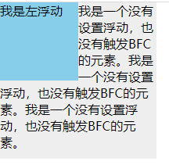
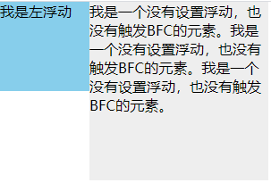

# BFC

BFC全称Block Formatting Context，即块级格式化上下文。

块格式上下文是页面CSS 视觉渲染的一部分，**用于决定块盒子的布局及浮动相互影响范围的一个区域**。

**具有BFC特性的元素可以看作是隔离了的独立容器，容器里面的元素不会在布局上影响到外面的元素，并且BFC具有普通容器所没有的一些特性**。

BFC包含创建了该上下文元素的所有子元素，但不包括开启BFC的子元素的内部元素。

### 1. BFC的创建方法

* 根元素或其他包含它的元素
* 浮动
* 绝对定位元素（position为absolu或fixed）
* display为inline-block、table-cell、flex
* 表格单元格（display: table-cell）
* overflow除了visible以外的值（hidden、auto、scroll）


### 2. BFC的应用

#### 2.1 避免外边距折叠

由于CSS2.1规范，所有毗邻的两个或更多盒元素的margin将会合并为一个margin共享之。毗邻的定义为：同级或者嵌套的盒元素，并且它们之间没有非空内容、Padding或Border分隔。

```html
<style>
  #out {
		width: 100px;
    height: 100px
  }
  #in {
		width: 50px;
    height: 50px;
    margin-top: 30px;
  }
</style>
<div id="out">
  <div id="in">
  </div>
</div>
```

可以发现，子元素in设置margin-top会导致父元素out与页面顶部也隔开30px，这就是外边距合并共享导致的。

解决办法就是：

* 给父元素添加border-top或者padding-top
* 父元素开启BFC

#### 2.2 包含浮动的元素（清楚浮动）

父元素内部的子元素开启了浮动，子元素脱离文档流，如果父元素没有开启BFC，那么在父元素计算高度时就不会考虑开启浮动的子元素，于是就发生了**高度塌陷**。

因此给父元素开启BFC，可以解决高度塌陷的问题。


#### 2.3 阻止元素被浮动元素覆盖

当一个元素开启了浮动，也就脱离了文档流，不会占用文档流的位置，其他正常的元素则会在浮动元素的下方正常布局，就导致了被覆盖。

**可以分为两类：**

* 覆盖文档流中的元素
* 文档流中的文字会环绕在浮动元素周围




可以看出，其实在发生文字环绕的过程中，已经发生了元素被覆盖的现象。

为了避免被覆盖，可以给元素开启BFC，那么灰色的块（包括文字）就会展示在浮动元素的旁边了,从而解决了元素被覆盖。

