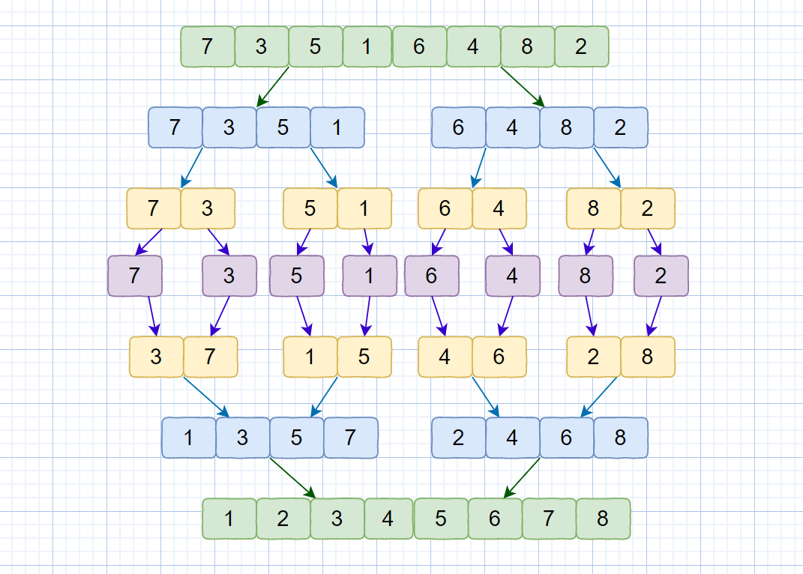

# 归并排序

归并排序使用的就是分治思想，将一个大问题分解成若干个小的子问题来解决。



我们一趟归并，需要将两个小集合的长度放到大集合中，则需要将待排序序列中的所有记录扫描一遍所以时间复杂度为O(n)。归并排序把集合一层一层的折半分组，则由完全二叉树的深度可知，整个排序过程需要进行 logn（向上取整）次,则总的时间复杂度为 O(nlogn)。

**代码思路：**

* 数组进入主函数入口，将数组拆分为两个数组
* 两个数组分别调用主函数进行排序
* 最后合并排好序的两个数组并返回

```javascript
function mergeSort(arr) {    // 主入口
  let len = arr.length;
  if (len < 2) return arr;
  let mid = Math.floor(len / 2);
  let left = arr.slice(0, mid);
  let right = arr.slice(mid);
  return merge(mergeSort(left), mergeSort(right));
}

function merge(left, right) {    // 用于合并两个排好序的数组
  const res = [];
  while (left.length && right.length) {
    if (left[0] < right[0]) {
      res.push(left.shift());
    } else {
      res.push(right.shift());
    }
  }
  while (left.length) res.push(left.shift());
  while (right.length) res.push(right.shift());
  return res;
}
```

