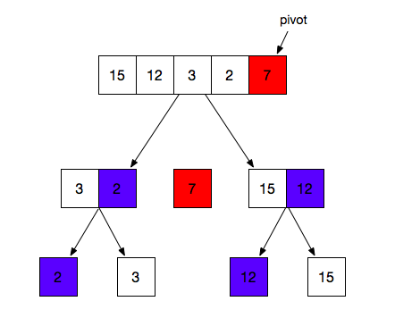

# 快速排序

**三个基本步骤：**

* 从数组中选择一个元素作为基准点
* 排序数组：所有比基准值小的放在左边，比基准值大的放在右边。每次分割结束后，基准值会插入到中间。
* 利用递归，将摆放在左右两边的数组重复上述1、2操作



### **简版：**

```javascript
var quickSort = function (arr) {
  if (arr.length <= 1) {
    return arr;
  }
  var pivotIndex = Math.floor(arr.length / 2);   // 寻找中间元素作为基准点
  var pivot = arr.splice(pivotIndex, 1)[0];
  var left = [];
  var right = [];

  for (var i = 0; i < arr.length; i++) {    // 将小于、大于基准点的值分别推入左右两个数组
    if (arr[i] < pivot) {
      left.push(arr[i]);
    } else {
      right.push(arr[i]);
    }
  }
  return quickSort(left).concat([pivot], quickSort(right));
};
```

缺点：

* 查找基准点使用了splice，会对数组进行一次拷贝操作
* 每次执行都创建了两个数组，浪费空间
* concat也会对数组进行一次拷贝

### **靠谱版**

```javascript
function quickSort(arr, start, end) {
  if(start >= end) return arr;
  let i = start, j = end, pivot = arr[start];
  while(i < j) {
    while(i < j && arr[j] >= pivot) {
			j--;
    }
    while(i < j && arr[i] <= pivot) {
      i++;
    }
    if(i < j) {
			[arr[i], arr[j]] = [arr[j], arr[i]];
    }
  }
  arr[start] = arr[i];
  arr[i] = pivot;
  quickSort(arr, start, i - 1);
  quickSort(arr, i + 1, end);
  
}
```

